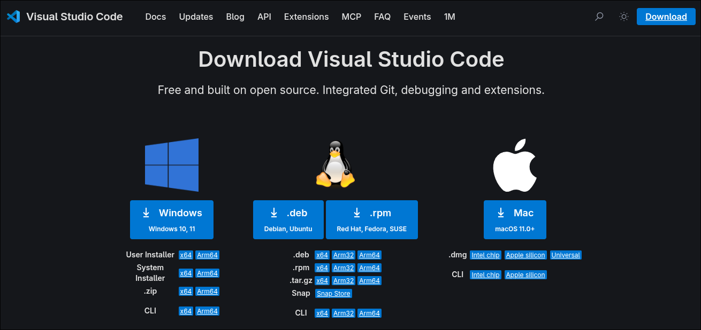
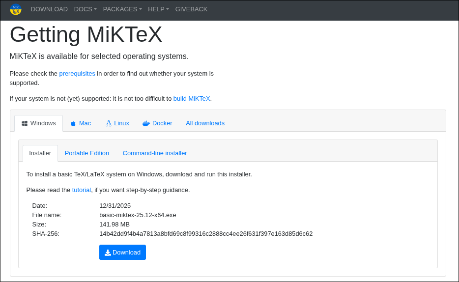
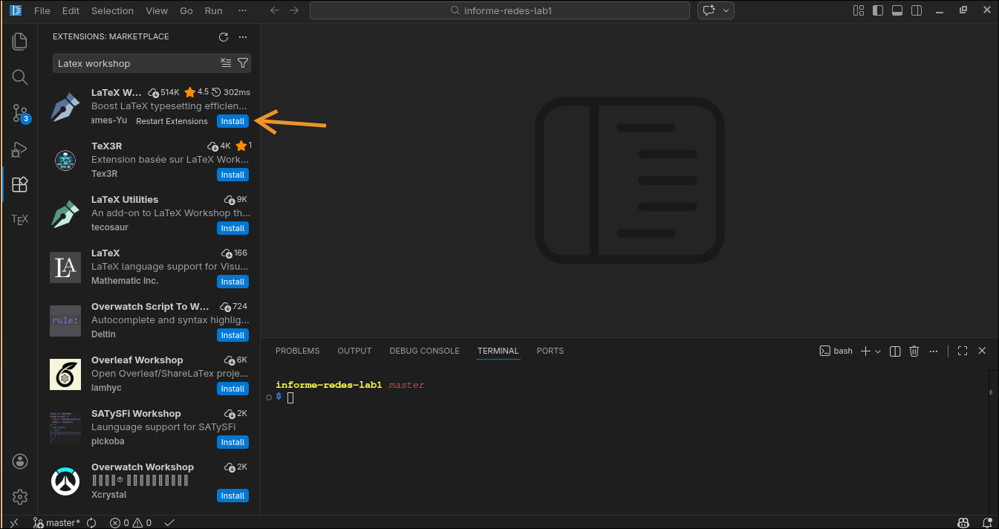
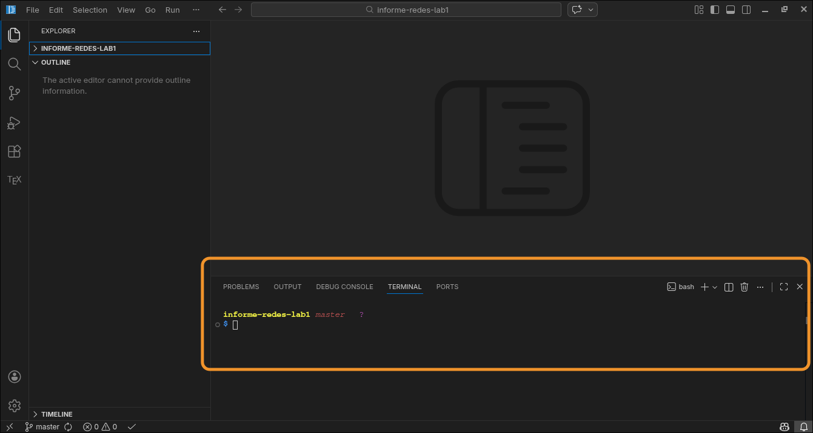

# Guía rápida para trabajar con LaTeX en Visual Studio Code

Este proyecto utiliza **LaTeX** para generar el documento y **Visual Studio Code** como entorno de edición.
Para compilar correctamente el documento es necesario instalar algunas herramientas.

---

# 1. Instalar Visual Studio Code

1. Ir a la página oficial de Visual Studio Code:
   https://code.visualstudio.com/Download

2. Descargar la versión correspondiente a su sistema operativo:

   * Linux
   * Windows
   * macOS

3. Ejecutar el instalador y seguir los pasos normales de instalación.

4. Una vez instalado, abrir **Visual Studio Code**.



* Pantalla de descarga de VS Code.

---

# 2. Instalar una distribución de LaTeX

Para poder compilar documentos `.tex` es necesario instalar una distribución de LaTeX.

## Linux

En sistemas basados en Arch:

```bash
sudo pacman -S texlive-most
```

En sistemas basados en Debian/Ubuntu:

```bash
sudo apt install texlive-full
```

## Windows

Instalar **MiKTeX** desde:

https://miktex.org/download

## macOS

Instalar **MacTeX** desde:

https://tug.org/mactex/



---

# 3. Instalar la extensión LaTeX Workshop

Dentro de Visual Studio Code:

1. Abrir la pestaña **Extensions** (icono de bloques en la barra lateral).
2. Buscar **LaTeX Workshop**.
3. Instalar la extensión.

Esta extensión permite:

* Compilar documentos LaTeX
* Previsualizar el PDF
* Navegar entre código y PDF
* Manejar bibliografía automáticamente



---

# 4. Autenticarse en GitHub y clonar el proyecto desde la terminal de VS Code

Para descargar el proyecto se utilizará la herramienta **GitHub CLI (`gh`)**, que permite autenticarse y trabajar con repositorios directamente desde la terminal.

## 4.1 Abrir la terminal en VS Code

Dentro de Visual Studio Code abrir la terminal integrada:

```
Terminal → New Terminal
```

También se puede usar el atajo:

```
Ctrl + `
```

📷 *Sugerencia de imagen:*



---

## 4.2 Instalar GitHub CLI

### Linux (Arch)

```bash
sudo pacman -S github-cli
```

### Linux (Debian/Ubuntu)

```bash
sudo apt install gh
```

### Windows / macOS

Descargar desde:

https://cli.github.com/

---

## 4.3 Autenticarse en GitHub

En la terminal ejecutar:

```bash
gh auth login
```

Luego seguir las opciones recomendadas:

```
GitHub.com
HTTPS
Login with a web browser
```

---

## 4.4 Clonar el repositorio

Una vez autenticado, el repositorio puede clonarse usando:

```bash
gh repo clone SAValenciaA/informe-redes-lab1
```

---

## 4.5 Entrar al directorio del proyecto

Después de clonar el repositorio:

```bash
cd nombre-del-repositorio
```

Si el proyecto no se abrió automáticamente en VS Code, se puede abrir con:

```bash
code .
```

---

# 5. Compilar el documento

El archivo principal del proyecto es:

```
main.tex
```

Para compilar:

### Opción 1 (automática)

Guardar el archivo (`Ctrl + S`).
La extensión compilará el documento automáticamente.

### Opción 2 (manual)

Presionar:

```
Ctrl + Alt + B
```

Esto ejecutará el proceso de compilación.

---

# 6. Ver el PDF

Después de compilar el documento, se puede abrir el PDF utilizando el visor integrado de VS Code.

Para abrir el visor de PDF usar el atajo:

```
Ctrl + Alt + V
```

Este comando ejecuta la función **View LaTeX PDF**, que abre el archivo PDF generado dentro de Visual Studio Code.

También se puede abrir manualmente desde la paleta de comandos:

```
Ctrl + Shift + P
```

y buscar:

```
LaTeX Workshop: View LaTeX PDF
```

Una vez abierto el visor, el PDF se actualizará automáticamente cada vez que el documento se vuelva a compilar.

---

# 7. Estructura del proyecto

El proyecto está organizado en múltiples archivos para facilitar su mantenimiento.

```
project/
│
├── main.tex
├── referencias.bib
│
├── sections/
│   ├── marco_teorico.tex
│   ├── metodologia.tex
│   └── referencias.tex
│
├── figures/
│
├── build/
│
└── .vscode/
```

* `main.tex` → archivo principal del documento
* `sections/` → secciones del documento
* `referencias.bib` → base de datos bibliográfica
* `figures/` → imágenes del documento
* `build/` → archivos generados durante la compilación

Puedes ignorar todo lo demas.

---

# 8. Bibliografía

El proyecto utiliza **BibLaTeX** con **Biber** para manejar las referencias.

Ejemplo de cita en el texto:

```latex
\cite{clave}
```

---

# 10. Recomendaciones

* No modificar los archivos dentro de `build/`.
* Mantener las nuevas secciones dentro de la carpeta `sections/`.
* Guardar las imágenes dentro de `figures/`.

